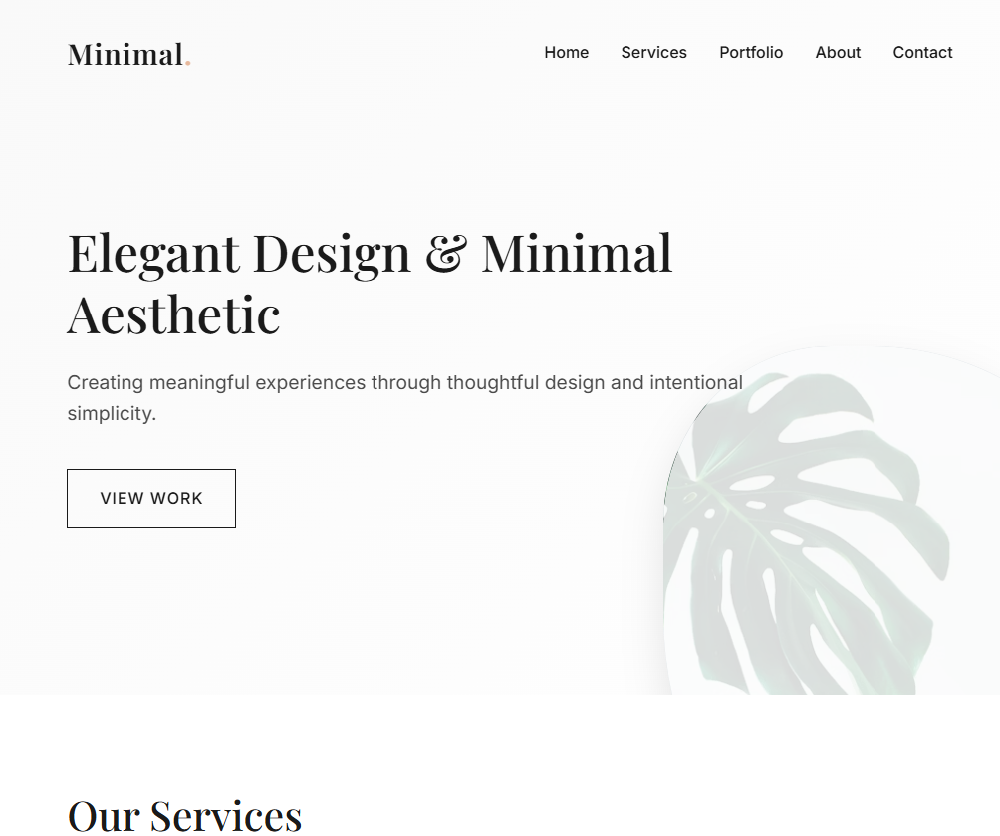

# Minimalist Portfolio Template



A clean, responsive, and modern portfolio template for designers, developers, and creatives. Built with pure HTML, CSS, and JavaScript.

## Features

- 🎨 **Minimalist Design**: Clean aesthetics with thoughtful typography and spacing
- 📱 **Fully Responsive**: Works perfectly on all device sizes
- ✨ **Modern Animations**: Subtle animations for enhanced user experience
- 🚀 **Performance Optimized**: Lightweight and fast-loading
- 🛠 **Easy to Customize**: Well-structured code for quick modifications

## Sections Included

✔ Hero Section  
✔ Services Showcase  
✔ Portfolio Grid  
✔ About Section  
✔ Testimonials  
✔ Contact Form  
✔ Responsive Footer  

## Technologies Used

- HTML5
- CSS3 (Flexbox, Grid, Custom Properties)
- JavaScript (ES6)
- Font Awesome Icons
- Google Fonts (Inter & Playfair Display)

## Live Demo

Check out the live demo: [https://worldsocoled.github.io/MinimalistTemplate/](https://worldsocoled.github.io/MinimalistTemplate/)

## Installation

1. Clone the repository:
```bash
git clone https://github.com/worldsocoled/MinimalistTemplate.git
```
2. Open index.html in your browser

## Customization

**To customize this template**:

-Replace the placeholder content in the HTML file

-Modify the color scheme by changing the CSS variables in the :root selector

-Update the portfolio items with your own projects

-Change fonts by replacing the Google Fonts link

-Add your own images by replacing the gradient backgrounds

## Browser Support

**Tested and works on**:

-Chrome (latest)

-Firefox (latest)

-Safari (latest)

-Edge (latest)

## License

This template is free to use for personal and commercial projects under the MIT License.

## Credits

Designed and developed by WorldSoColed Web Artistry

## Contributing

Contributions are welcome! Please open an issue or submit a pull request for any improvements.

Enjoy using this template or like the design? Consider giving it a ⭐ on GitHub!

